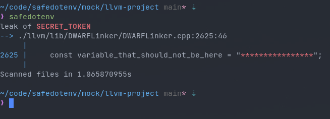

# Safedotenv

Safedotenv is tool to check if your code leaks any .env variables that are left in code for testing purposes.

Scanning [llvm](https://github.com/llvm/llvm-project) source code(8 million lines of code) takes around 1 second on Intel i7-10510U and NVMe. However there is still room for improvement.



- [Installation](#installation)
  * [Arch Linux](#arch-linux)
  * [Manual](#manual)
- [User Guide](#user-guide)
  * [Using with git hooks](#using-with-git-hooks)

## Installation

### Arch Linux

Install `safedotenv-git` from [AUR](https://aur.archlinux.org/packages/safedotenv-git/)

```
yay -S safedotenv-git
```

### Manual

```zsh
git clone git@github.com:gbaranski/safedotenv.git
cd safedotenv
cargo build --release
./target/release/safedotenv
```

## User Guide

Basic usage, scanning current directory recursively, assuming .env is present at current directory

```
safedotenv
```

Scanning current directory but with .env file somewhere else

```
safedotenv --env-file somedir/.env
```

Scanning specific directory but with .env file somewhere else

```
safedotenv --env-file somedir/.env ~/some/safe/dir
```


Scanning specific directory but with .env file somewhere else, ignoring `REFRESH_TOKEN` and `ACCESS_TOKEN` variables from .env

```
safedotenv --env-file somedir/.env --ignore-env REFRESH_TOKEN ACCESS_TOKEN ~/some/safe/dir
```

#### Using with git hooks

1. Open `.git/hooks/pre-commit` file(create if does not exits)
2. Add this code
```bash
#!/bin/bash

out=$(safedotenv --quiet $(git rev-parse --show-toplevel) 2>&1)

if [[ $out ]]; then
  echo -e "${out}"
  echo
  echo "Safedotenv prevented you from possibly commiting unsafe code, to ignore that, use"
  echo "  git commit --no-verify"
  exit 1
fi
```
3. Add permissions to execute file
```bash
chmod +x .git/hooks/pre-commit
```
